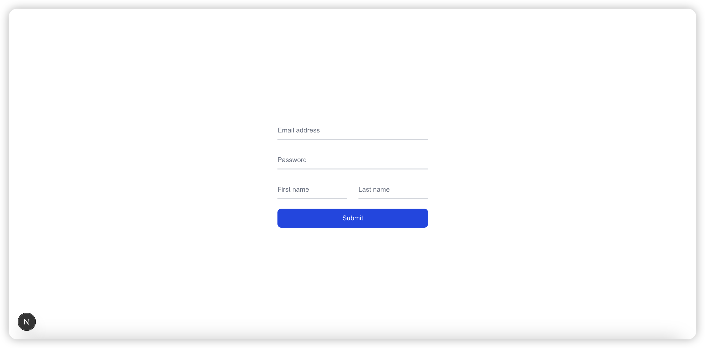
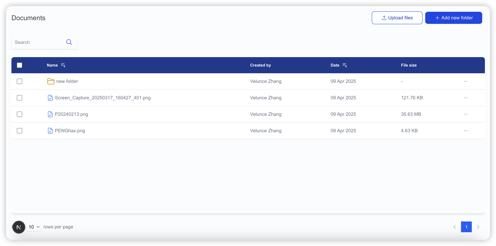
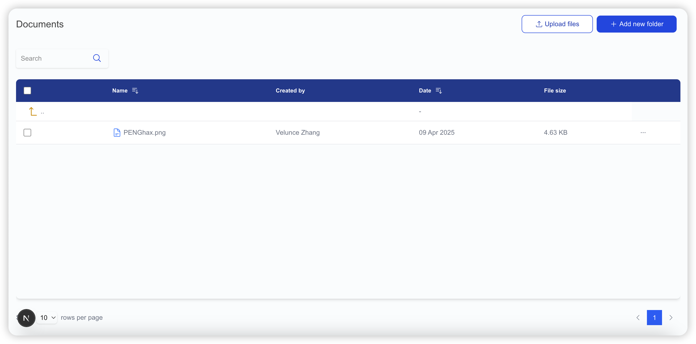

## About

This is a simple file management system. Based on Next.js, TypeScript, TypeORM and MySQL (supports versions higher than 8).

Functions include file upload, creating folders and subdirectories, and uploading files in subdirectories.

Due to personal time constraints, it took only 14 hours to complete this project. Most of the functions of the file management system are provided in the project as much as possible.

## Enviroment

Node.js latest LTS version

MySQL Community Server (9.2.0) or 8 above
(Option: MySQL Docker)

## Getting Started

Install dependencies

```bash
npm install
```

Setup project via command

```bash
npm run setup
```

Setup MySQL at 'lib/data-source.ts'

<mark>Be sure to create a database in MySQL first.</mark>

```JavaScript
// lib/data-source.ts
{
  type: "mysql",
  host: "127.0.0.1",
  port: 3306,
  username: "YOUR_USERNAME", // Replace with your database username
  password: "YOUR_PASSWORD", // Replace with your database password
  database: "YOUR_DATABASE", // Replace with your database name
  synchronize: true, // Enable automatic table synchronization during development
  entities: [Document, Folder, User],
}
```

Run it now !

```bash
npm run dev
# or
yarn dev
# or
pnpm dev
# or
bun dev
```

Open [http://localhost:3000](http://localhost:3000) with your browser to see the result.

## Project constructure

```bash
# Project Tree
.
├── README.md
├── app
│   ├── api
│   │   ├── folder
│   │   │   ├── [id]
│   │   │   │   └── route.ts
│   │   │   └── route.ts
│   │   ├── upload
│   │   │   └── route.ts
│   │   └── user
│   │       └── route.ts
│   ├── favicon.ico
│   ├── globals.css
│   ├── layout.tsx
│   ├── login
│   │   └── page.tsx # The login page is also the registration page.
│   └── page.tsx
├── components
│   ├── button.component.tsx
│   ├── documents.component.tsx
│   ├── modal.component.tsx
│   └── table.component.tsx
├── entities    # TypeORM entities
│   ├── Document.ts
│   ├── Folder.ts
│   └── User.ts
├── lib
│   ├── data-source.ts  # Config MySQL Database
│   ├── db.ts
│   └── utils.ts
├── .env.local  # Create via command 'npm run setup'
├── next-env.d.ts
├── next.config.ts
├── package-lock.json
├── package.json
├── postcss.config.mjs
├── public
│   ├── file.svg
│   ├── globe.svg
│   ├── next.svg
│   ├── uploads # Create via command 'npm run setup'. Upload file location.
│   ├── vercel.svg
│   └── window.svg
├── setup.sh
├── tsconfig.json
└── types.ts
```

## Instructions

The default page for the first use is to jump to the login page, where the user enters the email address, password, and name to create a user.

You can log in on this page later using the corresponding account.

---

## Screenshots

### Initialization and login page



### File Management Dashboard



### Subfolder Example



---

## Notes

- <mark>Ensure that a MySQL database is created beforehand, and configure the database name correctly in 'lib/data-source.ts'.</mark>
- Ensure that the `uploads` folder is created during the setup process. This folder is used to store uploaded files.
- The database schema is automatically synchronized during development (`synchronize: true` in `lib/data-source.ts`).

---

## License

This project is licensed under the MIT License.
